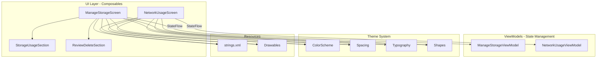

# Design Document: Material 3 Expressive Storage and Network Screens

## Overview

This design document specifies the technical approach for upgrading the Manage Storage and Network Usage screens from Material 2 to Material 3 Expressive design standards. The upgrade focuses on visual modernization while preserving all existing functionality and maintaining strict adherence to Clean Architecture principles.

### Scope

The design covers:
- Visual upgrade of `ManageStorageScreen.kt` and `NetworkUsageScreen.kt` composables
- Replacement of hardcoded values with theme system tokens
- Addition of new string resources for localization
- Enhanced visual hierarchy using Material 3 Expressive typography
- Improved component styling with Material 3 shapes and elevation
- Accessibility enhancements

### Out of Scope

- Changes to ViewModels or business logic
- Modifications to data layer or repositories
- New features beyond visual upgrade
- Changes to navigation structure

### Design Principles

1. **Theme System First**: All visual properties must use `MaterialTheme.colorScheme` and `Spacing` tokens
2. **Zero Hardcoding**: No hardcoded colors, dimensions, or text strings
3. **Clean Architecture Compliance**: UI layer only handles presentation, delegates all logic to ViewModels
4. **Accessibility by Default**: All interactive elements meet Material 3 accessibility guidelines
5. **Preserve Functionality**: Existing behavior remains unchanged

## Architecture

### Component Structure



### Layer Responsibilities

**UI Layer (Composables)**
- Render visual components using Material 3 Expressive design tokens
- Observe StateFlow from ViewModels
- Handle user interactions by invoking ViewModel methods or navigation callbacks
- Apply theme system tokens for all visual properties
- Use string resources for all text

**ViewModel Layer**
- Expose StateFlow for UI state
- Delegate data operations to repositories
- Handle loading states
- No changes required for this upgrade

**Theme System**
- Provide ColorScheme tokens via `MaterialTheme.colorScheme`
- Provide Spacing tokens via `Spacing` object
- Provide Typography via `MaterialTheme.typography`
- Provide Shapes via `MaterialTheme.shapes`

## Components and Interfaces

### ManageStorageScreen

**Purpose**: Main screen composable for storage management

**State Inputs** (from ManageStorageViewModel):
- `storageUsage: StateFlow<StorageUsageBreakdown?>`
- `largeFiles: StateFlow<List<LargeFileInfo>>`
- `isLoading: StateFlow<Boolean>`

**Navigation Callbacks**:
- `onBackClick: () -> Unit`

**Visual Structure**:
```
Scaffold
├── TopAppBar (Material 3, pinned scroll behavior)
│   ├── Navigation Icon (back button)
│   └── Title (from string resources)
└── Content
    ├── Loading State (CircularProgressIndicator)
    └── Loaded State (LazyColumn)
        ├── StorageUsageSection
        └── ReviewDeleteSection
```

**Material 3 Expressive Elements**:
- TopAppBar with `TopAppBarDefaults.pinnedScrollBehavior()`
- Typography: `MaterialTheme.typography.titleLarge` for app bar title
- Colors: `MaterialTheme.colorScheme.surface`, `onSurface`, `primary`
- Spacing: `Spacing.Medium` for content padding
- Elevation: Material 3 surface tonal elevation

### NetworkUsageScreen

**Purpose**: Main screen composable for network usage statistics

**State Inputs** (from NetworkUsageViewModel):
- `usageItems: StateFlow<List<NetworkUsageItem>>`
- `totalSent: StateFlow<Long>`
- `totalReceived: StateFlow<Long>`
- `isLoading: StateFlow<Boolean>`

**Navigation Callbacks**:
- `onBackClick: () -> Unit`

**Visual Structure**:
```
Scaffold
├── TopAppBar (Material 3, pinned scroll behavior)
│   ├── Navigation Icon (back button)
│   └── Title (from string resources)
└── Content
    ├── Loading State (CircularProgressIndicator)
    └── Loaded State (LazyColumn)
        ├── Usage Statistics Card
        ├── HorizontalDivider
        ├── Usage Items List
        └── Reset Statistics Button
```

**Material 3 Expressive Elements**:
- TopAppBar with `TopAppBarDefaults.pinnedScrollBehavior()`
- Surface container with `MaterialTheme.colorScheme.surfaceContainer`
- Shape: `MaterialTheme.shapes.large` for statistics card
- Typography: `MaterialTheme.typography.headlineMedium` for totals
- ListItem components with Material 3 styling

### StorageUsageSection

**Purpose**: Display storage usage breakdown with visual bar

**Props**:
- `storageUsage: StorageUsageBreakdown`

**Visual Structure**:
```
Column
├── Storage Summary Row
│   ├── Used Storage (primary color)
│   └── Free Storage (onSurfaceVariant)
├── Storage Bar Visualization
│   ├── Synapse Media (primary color)
│   ├── Apps & Other (tertiary color)
│   └── Free Space (surfaceVariant)
└── Legend Row
    ├── Synapse Badge + Label
    └── Apps Badge + Label
```

**Material 3 Expressive Elements**:
- Typography: `titleLarge` for storage amounts, `bodyMedium` for labels
- Colors: `primary`, `tertiary`, `surfaceVariant`, `onSurfaceVariant`
- Shapes: `MaterialTheme.shapes.medium` for storage bar
- Spacing: `Spacing.Medium`, `Spacing.Small` for consistent layout

### ReviewDeleteSection

**Purpose**: Display large files for review and deletion

**Props**:
- `largeFiles: List<LargeFileInfo>`

**Visual Structure**:
```
Column
├── Section Title (label style)
└── ListItem (Material 3)
    ├── Leading Icon (file type)
    ├── Headline ("Larger than 5 MB")
    ├── Supporting Text (total size)
    └── Trailing Icon (chevron right)
```

**Material 3 Expressive Elements**:
- Typography: `labelLarge` for section title, `bodyLarge` for list item
- ListItem with Material 3 styling
- Icons tinted with `MaterialTheme.colorScheme.primary`
- Spacing: `Spacing.Medium` for padding

### Theme System Integration

**ColorScheme Tokens** (from `MaterialTheme.colorScheme`):
- `primary`: Primary brand color for emphasis
- `onPrimary`: Text/icons on primary color
- `secondary`: Secondary brand color
- `tertiary`: Tertiary brand color for accents
- `surface`: Default surface background
- `surfaceContainer`: Elevated surface background
- `surfaceContainerLowest`: Divider/separator color
- `surfaceVariant`: Subtle background variant
- `onSurface`: Primary text color
- `onSurfaceVariant`: Secondary text color
- `outline`: Border and divider color

**Spacing Tokens** (from `Spacing` object):
- `Tiny` (2.dp): Minimal spacing
- `ExtraSmall` (4.dp): Very small spacing
- `Small` (8.dp): Small spacing, list item gaps
- `SmallMedium` (12.dp): Medium-small spacing
- `Medium` (16.dp): Standard padding and spacing
- `Large` (24.dp): Large spacing between sections
- `ExtraLarge` (32.dp): Extra large spacing
- `Huge` (48.dp): Maximum spacing

**Typography Scale** (from `MaterialTheme.typography`):
- `displayLarge`, `displayMedium`, `displaySmall`: Display text
- `headlineLarge`, `headlineMedium`, `headlineSmall`: Headlines
- `titleLarge`, `titleMedium`, `titleSmall`: Titles
- `bodyLarge`, `bodyMedium`, `bodySmall`: Body text
- `labelLarge`, `labelMedium`, `labelSmall`: Labels and captions

**Shape Tokens** (from `MaterialTheme.shapes`):
- `extraSmall`: Minimal rounding
- `small`: Small rounding for compact elements
- `medium`: Medium rounding for cards
- `large`: Large rounding for prominent surfaces
- `extraLarge`: Maximum rounding

## Data Models

### Existing Models (No Changes)

**StorageUsageBreakdown**
```kotlin
data class StorageUsageBreakdown(
    val totalSize: Long,      // Total device storage in bytes
    val usedSize: Long,       // Used storage in bytes
    val freeSize: Long,       // Free storage in bytes
    val appsAndOtherSize: Long, // Storage used by other apps
    val synapseSize: Long     // Storage used by Synapse
)
```

**LargeFileInfo**
```kotlin
data class LargeFileInfo(
    val fileId: String,       // Unique file identifier
    val fileName: String,     // Display name
    val size: Long,           // File size in bytes
    val thumbnailUri: String?, // Optional thumbnail
    val type: MediaType       // File type enum
)
```

**NetworkUsageItem**
```kotlin
data class NetworkUsageItem(
    val label: String,        // Category label
    val iconRes: Int?,        // Optional icon resource
    val sentBytes: Long,      // Bytes sent
    val receivedBytes: Long   // Bytes received
)
```

### Utility Functions (Existing)

**formatBytes(bytes: Long): String**
- Converts bytes to human-readable format (B, KB, MB, GB)
- Used for displaying file sizes and network usage

**formatBytesToGB(bytes: Long): String**
- Converts bytes to GB with one decimal place
- Used for storage capacity display

## Correctness Properties

*A property is a characteristic or behavior that should hold true across all valid executions of a system—essentially, a formal statement about what the system should do. Properties serve as the bridge between human-readable specifications and machine-verifiable correctness guarantees.*


### Property 1: Storage Data Display Completeness

*For any* valid `StorageUsageBreakdown` with non-null values, the ManageStorageScreen SHALL display all storage data fields including total capacity, used storage, free storage, storage bar visualization, and category breakdown with badges.

**Validates: Requirements 5.1, 5.2, 5.3, 5.4, 5.5**

### Property 2: Large Files Display

*For any* list of `LargeFileInfo` items, the ManageStorageScreen SHALL display the "Review and delete items" section with the total size of all files larger than 5 MB.

**Validates: Requirements 6.1, 6.2**

### Property 3: Network Statistics Display Completeness

*For any* valid network usage data (totalSent, totalReceived, usageItems list), the NetworkUsageScreen SHALL display all statistics including total sent bytes, total received bytes, and the usage statistics container.

**Validates: Requirements 7.1, 7.2, 7.3**

### Property 4: Network Usage Items Display

*For any* list of `NetworkUsageItem` objects, the NetworkUsageScreen SHALL display all items in list format with both sent and received bytes shown for each category.

**Validates: Requirements 8.1, 8.2**

### Property 5: Storage Screen Back Navigation

*For any* ManageStorageScreen instance, the screen SHALL provide a back navigation button that invokes the `onBackClick` callback when tapped.

**Validates: Requirements 9.1, 9.5**

### Property 6: Network Screen Back Navigation

*For any* NetworkUsageScreen instance, the screen SHALL provide a back navigation button that invokes the `onBackClick` callback when tapped.

**Validates: Requirements 9.2, 9.6**

### Property 7: Network Screen Reset Button

*For any* NetworkUsageScreen instance, the screen SHALL provide a "Reset Statistics" button using Material 3 text button styling.

**Validates: Requirements 9.3**

### Property 8: Storage Screen Interactive List Items

*For any* ManageStorageScreen with large files, the large file list items SHALL be interactive and provide navigation affordances.

**Validates: Requirements 9.4**

### Property 9: Storage Screen TopAppBar Presence

*For any* ManageStorageScreen instance, the screen SHALL include a Material 3 TopAppBar with pinned scroll behavior.

**Validates: Requirements 10.1**

### Property 10: Network Screen TopAppBar Presence

*For any* NetworkUsageScreen instance, the screen SHALL include a Material 3 TopAppBar with pinned scroll behavior.

**Validates: Requirements 10.2**

### Property 11: Storage Screen Icon Accessibility

*For all* icons in the ManageStorageScreen, each icon SHALL have a content description defined for accessibility.

**Validates: Requirements 12.1**

### Property 12: Network Screen Icon Accessibility

*For all* icons in the NetworkUsageScreen, each icon SHALL have a content description defined for accessibility.

**Validates: Requirements 12.2**

### Property 13: Storage Screen Touch Target Sizes

*For all* interactive elements in the ManageStorageScreen, the minimum touch target size SHALL be at least 48dp as per Material 3 guidelines.

**Validates: Requirements 12.5**

### Property 14: Network Screen Touch Target Sizes

*For all* interactive elements in the NetworkUsageScreen, the minimum touch target size SHALL be at least 48dp as per Material 3 guidelines.

**Validates: Requirements 12.6**

### Property 15: Storage Screen State Reactivity

*For any* change in ManageStorageViewModel state (storageUsage, largeFiles, isLoading), the ManageStorageScreen SHALL update its UI to reflect the new state.

**Validates: Requirements 13.1, 13.7**

### Property 16: Network Screen State Reactivity

*For any* change in NetworkUsageViewModel state (usageItems, totalSent, totalReceived, isLoading), the NetworkUsageScreen SHALL update its UI to reflect the new state.

**Validates: Requirements 13.2, 13.8**

## Error Handling

### Loading States

**Storage Screen**:
- When `isLoading = true` or `storageUsage = null`: Display centered `CircularProgressIndicator`
- When `isLoading = false` and `storageUsage != null`: Display content
- Empty `largeFiles` list: Display section with "0 B" total size

**Network Screen**:
- When `isLoading = true`: Display centered `CircularProgressIndicator`
- When `isLoading = false`: Display content
- Empty `usageItems` list: Display empty list (no items)

### Error States

Since this is a UI-only upgrade, error handling remains in the ViewModel layer:
- ViewModels handle repository errors
- ViewModels expose error states via StateFlow if needed
- UI layer only handles loading and loaded states

### Edge Cases

**Storage Screen**:
- Zero storage used: Display "0 B used" with empty storage bar
- Full storage: Display 100% filled storage bar
- Very large numbers: Use `formatBytes()` utility for human-readable display
- Null thumbnail URIs: Handle gracefully in file list

**Network Screen**:
- Zero network usage: Display "0 B" for sent/received
- Missing icons: Use default icon resource
- Very large byte counts: Use `formatBytes()` utility

### Accessibility Error Prevention

- All icons must have `contentDescription` (null for decorative icons)
- All interactive elements must meet 48dp minimum touch target
- Text must use theme colors for automatic contrast compliance
- Loading indicators must have semantic labels

## Testing Strategy

### Dual Testing Approach

This feature requires both unit tests and property-based tests for comprehensive coverage:

**Unit Tests**: Focus on specific examples, edge cases, and UI component behavior
**Property Tests**: Verify universal properties across all valid inputs

Both testing approaches are complementary and necessary. Unit tests catch concrete bugs in specific scenarios, while property tests verify general correctness across a wide range of inputs.

### Unit Testing

**Focus Areas**:
- Specific loading state transitions
- Edge cases (empty lists, zero values, null data)
- Navigation callback invocations
- String resource usage verification
- Theme token usage verification (code review)

**Example Unit Tests**:
```kotlin
@Test
fun `when isLoading is true, shows progress indicator`()

@Test
fun `when storageUsage is null, shows progress indicator`()

@Test
fun `when largeFiles is empty, shows zero size`()

@Test
fun `back button click invokes onBackClick callback`()

@Test
fun `reset button exists on network screen`()
```

**Unit Test Balance**:
- Keep unit tests focused on specific examples and edge cases
- Avoid writing too many unit tests for scenarios covered by property tests
- Property tests handle comprehensive input coverage through randomization
- Unit tests should focus on integration points and specific user interactions

### Property-Based Testing

**Library Selection**: Use **Kotest Property Testing** for Kotlin/Android
- Native Kotlin support
- Excellent Compose UI testing integration
- Built-in generators for common types
- Minimum 100 iterations per test

**Property Test Configuration**:
```kotlin
class ManageStorageScreenPropertyTest : FunSpec({
    test("Property 1: Storage Data Display Completeness")
        .config(invocations = 100) {
        checkAll<StorageUsageBreakdown> { breakdown ->
            // Test implementation
        }
    }
})
```

**Test Tagging Format**:
Each property test must include a comment referencing the design property:
```kotlin
// Feature: material3-storage-network-screens, Property 1: Storage Data Display Completeness
```

**Property Test Focus Areas**:

1. **Data Display Properties** (Properties 1-4):
   - Generate random `StorageUsageBreakdown` instances
   - Generate random lists of `LargeFileInfo` and `NetworkUsageItem`
   - Verify all data appears in rendered composition
   - Use Compose testing semantics to find nodes

2. **Navigation Properties** (Properties 5-8):
   - Test back button presence and callback invocation
   - Test reset button presence
   - Test list item interactivity

3. **Component Presence Properties** (Properties 9-10):
   - Verify TopAppBar exists in composition tree
   - Verify scroll behavior configuration

4. **Accessibility Properties** (Properties 11-14):
   - Generate random icon sets
   - Verify all have content descriptions
   - Measure touch target sizes programmatically

5. **State Reactivity Properties** (Properties 15-16):
   - Generate random state transitions
   - Verify UI updates for each state change
   - Test with various combinations of loading/loaded states

**Custom Generators**:
```kotlin
val arbStorageBreakdown = arbitrary {
    StorageUsageBreakdown(
        totalSize = Arb.long(1_000_000_000L..1_000_000_000_000L).bind(),
        usedSize = Arb.long(0L..500_000_000_000L).bind(),
        freeSize = Arb.long(0L..500_000_000_000L).bind(),
        appsAndOtherSize = Arb.long(0L..250_000_000_000L).bind(),
        synapseSize = Arb.long(0L..250_000_000_000L).bind()
    )
}

val arbLargeFileInfo = arbitrary {
    LargeFileInfo(
        fileId = Arb.uuid().bind().toString(),
        fileName = Arb.string(5..50).bind(),
        size = Arb.long(5_000_000L..10_000_000_000L).bind(),
        thumbnailUri = Arb.orNull(Arb.string()).bind(),
        type = Arb.enum<MediaType>().bind()
    )
}
```

### Integration Testing

**Compose UI Tests**:
- Test complete screen rendering with real ViewModels
- Verify theme system integration
- Test user interaction flows
- Verify accessibility tree structure

**Screenshot Tests**:
- Capture screenshots in light/dark themes
- Verify Material 3 Expressive visual design
- Compare before/after upgrade
- Test on different screen sizes

### Code Review Checklist

Since many requirements are code structure constraints, code review is essential:

- [ ] No hardcoded colors (all use `MaterialTheme.colorScheme`)
- [ ] No hardcoded dimensions (all use `Spacing` tokens)
- [ ] No hardcoded text (all use `stringResource()`)
- [ ] All typography uses `MaterialTheme.typography`
- [ ] All shapes use `MaterialTheme.shapes`
- [ ] No business logic in composables
- [ ] StateFlow used for all state observation
- [ ] No direct repository/data source access
- [ ] All icons have content descriptions
- [ ] Minimum 48dp touch targets for interactive elements

### Test Coverage Goals

- **Unit Tests**: 80%+ coverage of composable functions
- **Property Tests**: 100% coverage of correctness properties (16 properties)
- **Integration Tests**: Critical user flows (navigation, data display)
- **Accessibility Tests**: 100% of interactive elements

### Continuous Testing

- Run unit tests on every commit
- Run property tests (100 iterations) in CI/CD pipeline
- Run screenshot tests on PR creation
- Manual accessibility testing with TalkBack before release


## Implementation Details

### String Resources Required

The following string resources must be added to `app/src/main/res/values/strings.xml`:

```xml
<!-- Manage Storage Screen -->
<string name="storage_manage_title">Manage Storage</string>
<string name="storage_review_delete_title">Review and delete items</string>
<string name="storage_large_files_label">Larger than 5 MB</string>
<string name="cd_back_button">Navigate back</string>
<string name="cd_storage_badge">Storage category indicator</string>
<string name="cd_file_icon">File type icon</string>
<string name="cd_chevron_right">View details</string>

<!-- Network Usage Screen -->
<string name="network_usage_title">Network Usage</string>
<string name="network_usage_label">Usage</string>
<string name="network_sent_label">Sent</string>
<string name="network_received_label">Received</string>
<string name="network_reset_statistics">Reset Statistics</string>
<string name="cd_upload_icon">Upload indicator</string>
<string name="cd_download_icon">Download indicator</string>
<string name="cd_category_icon">Category icon</string>
```

### Material 3 Expressive Typography Mapping

**ManageStorageScreen**:
- App bar title: `MaterialTheme.typography.titleLarge`
- Storage amounts (used/free): `MaterialTheme.typography.titleLarge`
- Section titles: `MaterialTheme.typography.labelLarge`
- Category labels: `MaterialTheme.typography.bodyMedium`
- File list headline: `MaterialTheme.typography.bodyLarge`
- File list supporting text: `MaterialTheme.typography.bodyMedium`

**NetworkUsageScreen**:
- App bar title: `MaterialTheme.typography.titleLarge`
- Usage section title: `MaterialTheme.typography.titleMedium`
- Sent/Received labels: `MaterialTheme.typography.bodyMedium`
- Sent/Received values: `MaterialTheme.typography.headlineMedium`
- List item headlines: `MaterialTheme.typography.bodyLarge`
- List item supporting text: `MaterialTheme.typography.bodyMedium`
- Reset button text: `MaterialTheme.typography.labelLarge`

### Color Scheme Mapping

**ManageStorageScreen**:
- TopAppBar background: `MaterialTheme.colorScheme.surface`
- TopAppBar content: `MaterialTheme.colorScheme.onSurface`
- Storage used text: `MaterialTheme.colorScheme.primary`
- Storage free text: `MaterialTheme.colorScheme.onSurfaceVariant`
- Storage bar - Synapse: `MaterialTheme.colorScheme.primary`
- Storage bar - Apps: `MaterialTheme.colorScheme.tertiary`
- Storage bar - Free: `MaterialTheme.colorScheme.surfaceVariant` (alpha 0.3)
- Section divider: `MaterialTheme.colorScheme.surfaceContainerLowest`
- File icons: `MaterialTheme.colorScheme.primary`
- List item text: `MaterialTheme.colorScheme.onSurface`

**NetworkUsageScreen**:
- TopAppBar background: `MaterialTheme.colorScheme.surface`
- TopAppBar content: `MaterialTheme.colorScheme.onSurface`
- Statistics container background: `MaterialTheme.colorScheme.surfaceContainer`
- Statistics title: `MaterialTheme.colorScheme.onSurface`
- Statistics labels: `MaterialTheme.colorScheme.onSurfaceVariant`
- Statistics values: `MaterialTheme.colorScheme.onSurface`
- Category icons: `MaterialTheme.colorScheme.primary`
- Upload/download icons: `MaterialTheme.colorScheme.onSurfaceVariant`
- List item text: `MaterialTheme.colorScheme.onSurface`
- Reset button text: `MaterialTheme.colorScheme.primary`

### Spacing Token Mapping

**ManageStorageScreen**:
- Content padding: `Spacing.Medium` (16.dp)
- Section spacing: `Spacing.Large` (24.dp)
- Storage bar height: `Spacing.Small` (8.dp)
- Badge size: `Spacing.Small` (8.dp)
- Badge to label spacing: `Spacing.Small` (8.dp)
- Between badges: `Spacing.Medium` (16.dp)
- List item vertical padding: `Spacing.ExtraSmall` (4.dp)
- Divider thickness: `Spacing.Small` (8.dp)
- Bottom content padding: `Spacing.Medium` (16.dp)

**NetworkUsageScreen**:
- Content padding: `Spacing.Medium` (16.dp)
- Statistics container padding: `Spacing.Medium` (16.dp)
- Statistics internal spacing: `Spacing.Medium` (16.dp)
- Icon size (category): `Spacing.Large` (24.dp)
- Icon size (upload/download): `Spacing.SmallMedium` (12.dp)
- Icon to text spacing: `Spacing.ExtraSmall` (4.dp)
- Between upload/download: `Spacing.Medium` (16.dp)
- Divider vertical padding: `Spacing.Small` (8.dp)
- Reset button padding: `Spacing.Medium` (16.dp)

### Shape Token Mapping

**ManageStorageScreen**:
- Storage bar: `MaterialTheme.shapes.small`
- Section dividers: No shape (flat)

**NetworkUsageScreen**:
- Statistics container: `MaterialTheme.shapes.large`
- List items: Default Material 3 ListItem shape

### Component Specifications

#### TopAppBar Configuration

Both screens use identical TopAppBar configuration:

```kotlin
TopAppBar(
    title = { 
        Text(stringResource(R.string.storage_manage_title)) // or network_usage_title
    },
    navigationIcon = {
        IconButton(onClick = onBackClick) {
            Icon(
                painter = painterResource(id = R.drawable.ic_arrow_back),
                contentDescription = stringResource(R.string.cd_back_button)
            )
        }
    },
    scrollBehavior = TopAppBarDefaults.pinnedScrollBehavior(),
    colors = TopAppBarDefaults.topAppBarColors(
        containerColor = MaterialTheme.colorScheme.surface,
        titleContentColor = MaterialTheme.colorScheme.onSurface,
        navigationIconContentColor = MaterialTheme.colorScheme.onSurface
    )
)
```

#### Loading State Component

Both screens use identical loading state:

```kotlin
if (isLoading) {
    Box(
        modifier = Modifier
            .fillMaxSize()
            .padding(padding),
        contentAlignment = Alignment.Center
    ) {
        CircularProgressIndicator(
            color = MaterialTheme.colorScheme.primary
        )
    }
}
```

#### Storage Bar Visualization

Enhanced implementation with Material 3 Expressive styling:

```kotlin
Canvas(
    modifier = Modifier
        .fillMaxWidth()
        .height(Spacing.Small)
        .clip(MaterialTheme.shapes.small)
) {
    val totalWidth = size.width
    val synapseWidth = (usage.synapseSize.toFloat() / usage.totalSize) * totalWidth
    val otherWidth = (usage.appsAndOtherSize.toFloat() / usage.totalSize) * totalWidth
    
    // Background (free space)
    drawRect(
        color = MaterialTheme.colorScheme.surfaceVariant.copy(alpha = 0.3f)
    )
    
    // Synapse usage
    drawLine(
        color = MaterialTheme.colorScheme.primary,
        start = Offset(0f, size.height / 2),
        end = Offset(synapseWidth, size.height / 2),
        strokeWidth = size.height,
        cap = StrokeCap.Round
    )
    
    // Apps and other usage
    drawLine(
        color = MaterialTheme.colorScheme.tertiary,
        start = Offset(synapseWidth, size.height / 2),
        end = Offset(synapseWidth + otherWidth, size.height / 2),
        strokeWidth = size.height,
        cap = StrokeCap.Butt
    )
}
```

#### Network Statistics Container

Material 3 Expressive surface container:

```kotlin
Column(
    modifier = Modifier
        .fillMaxWidth()
        .padding(Spacing.Medium)
        .background(
            color = MaterialTheme.colorScheme.surfaceContainer,
            shape = MaterialTheme.shapes.large
        )
        .padding(Spacing.Medium)
) {
    Text(
        text = stringResource(R.string.network_usage_label),
        style = MaterialTheme.typography.titleMedium,
        color = MaterialTheme.colorScheme.onSurface
    )
    Spacer(modifier = Modifier.height(Spacing.Medium))
    Row(modifier = Modifier.fillMaxWidth()) {
        Column(modifier = Modifier.weight(1f)) {
            Text(
                text = stringResource(R.string.network_sent_label),
                style = MaterialTheme.typography.bodyMedium,
                color = MaterialTheme.colorScheme.onSurfaceVariant
            )
            Text(
                text = formatBytes(totalSent),
                style = MaterialTheme.typography.headlineMedium,
                color = MaterialTheme.colorScheme.onSurface
            )
        }
        Column(modifier = Modifier.weight(1f)) {
            Text(
                text = stringResource(R.string.network_received_label),
                style = MaterialTheme.typography.bodyMedium,
                color = MaterialTheme.colorScheme.onSurfaceVariant
            )
            Text(
                text = formatBytes(totalReceived),
                style = MaterialTheme.typography.headlineMedium,
                color = MaterialTheme.colorScheme.onSurface
            )
        }
    }
}
```

### Migration Strategy

#### Phase 1: Preparation
1. Add new string resources to `strings.xml`
2. Verify theme system tokens are available
3. Create feature branch from main

#### Phase 2: ManageStorageScreen Upgrade
1. Update TopAppBar with Material 3 styling
2. Replace hardcoded values in `StorageUsageSection.kt`
3. Replace hardcoded values in `ReviewDeleteSection.kt`
4. Update `ManageStorageScreen.kt` main composable
5. Add content descriptions to all icons
6. Run unit tests and fix any issues

#### Phase 3: NetworkUsageScreen Upgrade
1. Update TopAppBar with Material 3 styling
2. Replace hardcoded values in statistics container
3. Update list items with Material 3 styling
4. Update reset button styling
5. Add content descriptions to all icons
6. Run unit tests and fix any issues

#### Phase 4: Testing
1. Write/update unit tests for both screens
2. Write property-based tests for all 16 properties
3. Run accessibility tests with TalkBack
4. Capture screenshot tests
5. Manual testing in light/dark themes

#### Phase 5: Code Review & Deployment
1. Self-review against code review checklist
2. Submit PR with proper template
3. Address review feedback
4. Merge to main after approval

### Backward Compatibility

This upgrade maintains 100% backward compatibility:
- No API changes to composable functions
- No changes to ViewModel interfaces
- No changes to data models
- No changes to navigation structure
- Existing functionality preserved

### Performance Considerations

**Recomposition Optimization**:
- Use `remember` for computed values
- Use `derivedStateOf` for derived state
- Avoid unnecessary recompositions in list items

**Memory Efficiency**:
- Lazy loading for large file lists
- Efficient Canvas drawing for storage bar
- Proper disposal of resources

**Rendering Performance**:
- Material 3 components are optimized
- Theme token lookups are cached
- No complex custom drawing beyond storage bar

### Accessibility Compliance

**Screen Reader Support**:
- All icons have meaningful content descriptions
- Decorative icons use `contentDescription = null`
- Interactive elements have clear labels
- Loading states announce to screen readers

**Touch Target Sizes**:
- All buttons: minimum 48dp × 48dp
- List items: minimum 48dp height
- Icon buttons: 48dp × 48dp touch target

**Color Contrast**:
- Theme system ensures WCAG AA compliance
- Primary text: 4.5:1 contrast ratio
- Secondary text: 4.5:1 contrast ratio
- Interactive elements: 3:1 contrast ratio

**Focus Management**:
- Logical focus order (top to bottom)
- Focus indicators visible
- Keyboard navigation supported

### Localization Support

**String Resources**:
- All user-facing text in `strings.xml`
- Support for RTL languages
- Plurals handled correctly
- Format strings for dynamic values

**Layout Considerations**:
- Flexible layouts accommodate text expansion
- No fixed widths for text containers
- Icons remain consistent across locales

### Dark Theme Support

All color tokens automatically support dark theme:
- `MaterialTheme.colorScheme` adapts to theme
- No manual dark theme handling required
- Consistent appearance in both themes
- Proper contrast maintained

### Dynamic Color Support

Material 3 dynamic color (Material You):
- All colors use `MaterialTheme.colorScheme`
- Automatic adaptation to user's wallpaper
- Consistent brand identity maintained
- Fallback to default theme colors

## Dependencies

### Existing Dependencies (No Changes)

- Jetpack Compose Material 3
- Hilt for dependency injection
- Kotlin Coroutines
- StateFlow for reactive state
- Compose Navigation

### Testing Dependencies

- Kotest Property Testing (for property-based tests)
- Compose UI Testing
- JUnit 4
- Mockk (for mocking ViewModels in tests)

## Risks and Mitigations

### Risk 1: Visual Regression

**Risk**: Material 3 upgrade might introduce visual inconsistencies

**Mitigation**:
- Screenshot tests before/after
- Manual testing in both themes
- Stakeholder review of visual changes
- Gradual rollout with feature flag

### Risk 2: Accessibility Regression

**Risk**: Missing content descriptions or touch target violations

**Mitigation**:
- Automated accessibility tests
- Manual TalkBack testing
- Code review checklist enforcement
- Accessibility audit before release

### Risk 3: Performance Impact

**Risk**: Material 3 components might affect performance

**Mitigation**:
- Performance profiling before/after
- Recomposition tracking
- Memory leak detection
- Benchmark tests for critical paths

### Risk 4: Theme System Gaps

**Risk**: Required theme tokens might be missing

**Mitigation**:
- Audit theme system before implementation
- Add missing tokens if needed
- Document any theme system extensions
- Coordinate with design team

## Future Enhancements

### Post-MVP Improvements

1. **Animated Transitions**: Add Material 3 motion to state changes
2. **Haptic Feedback**: Add tactile feedback to interactions
3. **Advanced Visualizations**: Enhanced storage bar with animations
4. **Gesture Support**: Swipe actions for file management
5. **Adaptive Layouts**: Tablet and foldable optimizations

### Technical Debt Reduction

1. **Component Library**: Extract reusable components
2. **Design System Documentation**: Document all patterns
3. **Automated Visual Testing**: Expand screenshot coverage
4. **Performance Monitoring**: Add production metrics

## Conclusion

This design provides a comprehensive approach to upgrading the Manage Storage and Network Usage screens to Material 3 Expressive standards while maintaining Clean Architecture principles and ensuring zero functional regressions. The dual testing strategy with both unit and property-based tests ensures correctness across all scenarios, while the strict adherence to theme system tokens guarantees visual consistency and maintainability.

The implementation preserves all existing functionality, maintains backward compatibility, and enhances accessibility compliance. The phased migration strategy minimizes risk while the comprehensive testing approach ensures quality at every step.

