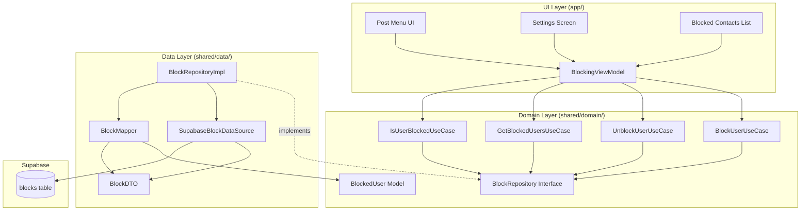
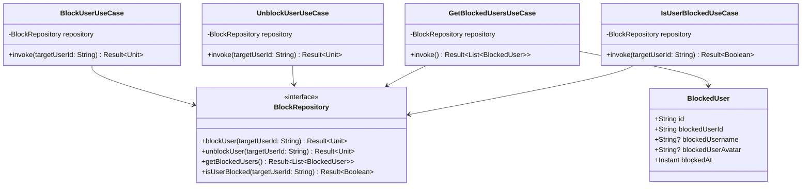

# User Blocking Feature - Design Document

## Overview

The user blocking feature enables users to prevent unwanted interactions by blocking other users within the Synapse social media application. This feature follows Clean Architecture principles with clear separation between domain, data, and UI layers. The implementation uses Supabase as the backend persistence layer and integrates seamlessly with the existing KMP architecture.

### Key Capabilities

- Block users directly from post menus for quick action
- Access and manage blocked contacts through Settings
- View a comprehensive list of all blocked users
- Unblock users to restore interactions
- Prevent duplicate blocking attempts
- Real-time synchronization across devices via Supabase
- Comprehensive error handling with user-friendly messages

### Architecture Alignment

This feature strictly adheres to the project's Clean Architecture guidelines:
- Domain layer contains pure Kotlin interfaces and models with no backend dependencies
- Data layer implements repositories using Supabase data sources
- UI layer uses ViewModels with StateFlow for reactive state management
- All UI components follow Material Theme guidelines with no hardcoded values

## Architecture

### Layer Structure



### Data Flow

1. **Block User Flow**
   - User taps "Block User" in post menu
   - UI calls `BlockingViewModel.blockUser(userId)`
   - ViewModel invokes `BlockUserUseCase`
   - Use case calls `BlockRepository.blockUser(userId)`
   - Repository checks for existing block via data source
   - If not blocked, creates new block record in Supabase
   - Result propagates back through layers
   - UI updates to show confirmation or error

2. **View Blocked Users Flow**
   - User navigates to Settings → Privacy & Security → Blocked Contacts
   - UI calls `BlockingViewModel.loadBlockedUsers()`
   - ViewModel invokes `GetBlockedUsersUseCase`
   - Use case calls `BlockRepository.getBlockedUsers()`
   - Repository fetches from Supabase via data source
   - DTOs are mapped to domain models
   - ViewModel updates StateFlow with blocked users list
   - UI observes StateFlow and displays list

3. **Unblock User Flow**
   - User taps "Unblock" on blocked contacts list
   - Confirmation dialog appears
   - On confirmation, UI calls `BlockingViewModel.unblockUser(userId)`
   - ViewModel invokes `UnblockUserUseCase`
   - Use case calls `BlockRepository.unblockUser(userId)`
   - Repository deletes block record from Supabase
   - Result propagates back through layers
   - UI removes user from list or shows error

## Components and Interfaces

### Domain Layer Components

#### BlockRepository Interface

```kotlin
package com.synapse.social.studioasinc.shared.domain.repository

interface BlockRepository {
    /**
     * Blocks a user by their user ID.
     * @param targetUserId The ID of the user to block
     * @return Result containing success or error
     */
    suspend fun blockUser(targetUserId: String): Result<Unit>
    
    /**
     * Unblocks a previously blocked user.
     * @param targetUserId The ID of the user to unblock
     * @return Result containing success or error
     */
    suspend fun unblockUser(targetUserId: String): Result<Unit>
    
    /**
     * Retrieves all users blocked by the current user.
     * @return Result containing list of blocked users or error
     */
    suspend fun getBlockedUsers(): Result<List<BlockedUser>>
    
    /**
     * Checks if a specific user is blocked.
     * @param targetUserId The ID of the user to check
     * @return Result containing boolean status or error
     */
    suspend fun isUserBlocked(targetUserId: String): Result<Boolean>
}
```

#### Domain Models

```kotlin
package com.synapse.social.studioasinc.shared.domain.model

import kotlinx.datetime.Instant

/**
 * Domain model representing a blocked user relationship.
 * Pure Kotlin with no backend dependencies.
 */
data class BlockedUser(
    val id: String,                    // Unique block record ID
    val blockedUserId: String,         // ID of the blocked user
    val blockedUsername: String?,      // Username for display
    val blockedUserAvatar: String?,    // Avatar URL for display
    val blockedAt: Instant             // Timestamp when block was created
)
```

#### Use Cases

```kotlin
package com.synapse.social.studioasinc.shared.domain.usecase.blocking

import com.synapse.social.studioasinc.shared.domain.repository.BlockRepository

/**
 * Use case for blocking a user.
 * Validates that user is not blocking themselves.
 */
class BlockUserUseCase(
    private val blockRepository: BlockRepository,
    private val getCurrentUserIdUseCase: GetCurrentUserIdUseCase
) {
    suspend operator fun invoke(targetUserId: String): Result<Unit> {
        val currentUserId = getCurrentUserIdUseCase() ?: 
            return Result.failure(IllegalStateException("User not authenticated"))
        
        if (currentUserId == targetUserId) {
            return Result.failure(IllegalArgumentException("Cannot block yourself"))
        }
        
        return blockRepository.blockUser(targetUserId)
    }
}

/**
 * Use case for unblocking a user.
 */
class UnblockUserUseCase(
    private val blockRepository: BlockRepository
) {
    suspend operator fun invoke(targetUserId: String): Result<Unit> {
        return blockRepository.unblockUser(targetUserId)
    }
}

/**
 * Use case for retrieving all blocked users.
 */
class GetBlockedUsersUseCase(
    private val blockRepository: BlockRepository
) {
    suspend operator fun invoke(): Result<List<BlockedUser>> {
        return blockRepository.getBlockedUsers()
    }
}

/**
 * Use case for checking if a user is blocked.
 */
class IsUserBlockedUseCase(
    private val blockRepository: BlockRepository
) {
    suspend operator fun invoke(targetUserId: String): Result<Boolean> {
        return blockRepository.isUserBlocked(targetUserId)
    }
}
```

### Data Layer Components

#### Data Transfer Objects (DTOs)

```kotlin
package com.synapse.social.studioasinc.shared.data.dto

import kotlinx.serialization.SerialName
import kotlinx.serialization.Serializable

/**
 * DTO for Supabase blocks table.
 * Maps directly to database schema.
 */
@Serializable
data class BlockDTO(
    @SerialName("id")
    val id: String,
    
    @SerialName("blocker_id")
    val blockerId: String,
    
    @SerialName("blocked_id")
    val blockedId: String,
    
    @SerialName("created_at")
    val createdAt: String
)

/**
 * Extended DTO with user profile information.
 * Used when fetching blocked users with their details.
 */
@Serializable
data class BlockWithUserDTO(
    @SerialName("id")
    val id: String,
    
    @SerialName("blocker_id")
    val blockerId: String,
    
    @SerialName("blocked_id")
    val blockedId: String,
    
    @SerialName("created_at")
    val createdAt: String,
    
    @SerialName("blocked_user")
    val blockedUser: UserProfileDTO?
)

@Serializable
data class UserProfileDTO(
    @SerialName("uid")
    val uid: String,
    
    @SerialName("username")
    val username: String?,
    
    @SerialName("avatar")
    val avatar: String?
)
```

#### Data Source

```kotlin
package com.synapse.social.studioasinc.shared.data.datasource

import com.synapse.social.studioasinc.shared.data.dto.BlockDTO
import com.synapse.social.studioasinc.shared.data.dto.BlockWithUserDTO
import io.github.jan.supabase.SupabaseClient
import io.github.jan.supabase.postgrest.postgrest
import io.github.jan.supabase.auth.auth

/**
 * Data source for blocking operations using Supabase.
 * Handles all direct communication with Supabase backend.
 */
class SupabaseBlockDataSource(
    private val client: SupabaseClient
) {
    private val tableName = "blocks"
    
    /**
     * Creates a new block record in Supabase.
     */
    suspend fun createBlock(targetUserId: String): Result<BlockDTO> = runCatching {
        val currentUserId = client.auth.currentUserOrNull()?.id 
            ?: throw IllegalStateException("User not authenticated")
        
        val blockData = mapOf(
            "blocker_id" to currentUserId,
            "blocked_id" to targetUserId
        )
        
        client.postgrest[tableName]
            .insert(blockData) {
                select()
            }
            .decodeSingle<BlockDTO>()
    }
    
    /**
     * Deletes a block record from Supabase.
     */
    suspend fun deleteBlock(targetUserId: String): Result<Unit> = runCatching {
        val currentUserId = client.auth.currentUserOrNull()?.id 
            ?: throw IllegalStateException("User not authenticated")
        
        client.postgrest[tableName]
            .delete {
                filter {
                    eq("blocker_id", currentUserId)
                    eq("blocked_id", targetUserId)
                }
            }
    }
    
    /**
     * Fetches all blocks for the current user with user profile details.
     */
    suspend fun getBlockedUsers(): Result<List<BlockWithUserDTO>> = runCatching {
        val currentUserId = client.auth.currentUserOrNull()?.id 
            ?: throw IllegalStateException("User not authenticated")
        
        client.postgrest[tableName]
            .select {
                filter {
                    eq("blocker_id", currentUserId)
                }
                // Join with users table to get profile info
                // Note: Requires Supabase RPC or view with joined data
            }
            .decodeList<BlockWithUserDTO>()
    }
    
    /**
     * Checks if a specific user is blocked.
     */
    suspend fun isUserBlocked(targetUserId: String): Result<Boolean> = runCatching {
        val currentUserId = client.auth.currentUserOrNull()?.id 
            ?: throw IllegalStateException("User not authenticated")
        
        val count = client.postgrest[tableName]
            .select {
                filter {
                    eq("blocker_id", currentUserId)
                    eq("blocked_id", targetUserId)
                }
                count(io.github.jan.supabase.postgrest.query.Count.EXACT)
            }
            .countOrNull() ?: 0
        
        count > 0
    }
}
```

#### Mapper

```kotlin
package com.synapse.social.studioasinc.shared.data.mapper

import com.synapse.social.studioasinc.shared.data.dto.BlockWithUserDTO
import com.synapse.social.studioasinc.shared.domain.model.BlockedUser
import kotlinx.datetime.Instant

/**
 * Maps between DTOs and domain models for blocking feature.
 */
object BlockMapper {
    
    fun toDomain(dto: BlockWithUserDTO): BlockedUser {
        return BlockedUser(
            id = dto.id,
            blockedUserId = dto.blockedId,
            blockedUsername = dto.blockedUser?.username,
            blockedUserAvatar = dto.blockedUser?.avatar,
            blockedAt = Instant.parse(dto.createdAt)
        )
    }
    
    fun toDomainList(dtos: List<BlockWithUserDTO>): List<BlockedUser> {
        return dtos.map { toDomain(it) }
    }
}
```

#### Repository Implementation

```kotlin
package com.synapse.social.studioasinc.shared.data.repository

import com.synapse.social.studioasinc.shared.data.datasource.SupabaseBlockDataSource
import com.synapse.social.studioasinc.shared.data.mapper.BlockMapper
import com.synapse.social.studioasinc.shared.domain.model.BlockedUser
import com.synapse.social.studioasinc.shared.domain.repository.BlockRepository
import kotlinx.coroutines.Dispatchers
import kotlinx.coroutines.withContext

/**
 * Implementation of BlockRepository using Supabase.
 * Coordinates between data source and domain layer.
 */
class BlockRepositoryImpl(
    private val dataSource: SupabaseBlockDataSource
) : BlockRepository {
    
    override suspend fun blockUser(targetUserId: String): Result<Unit> = 
        withContext(Dispatchers.Default) {
            // Check if already blocked
            val isBlocked = dataSource.isUserBlocked(targetUserId)
                .getOrElse { return@withContext Result.failure(it) }
            
            if (isBlocked) {
                return@withContext Result.failure(
                    IllegalStateException("User is already blocked")
                )
            }
            
            // Create block record
            dataSource.createBlock(targetUserId)
                .map { Unit }
        }
    
    override suspend fun unblockUser(targetUserId: String): Result<Unit> = 
        withContext(Dispatchers.Default) {
            dataSource.deleteBlock(targetUserId)
        }
    
    override suspend fun getBlockedUsers(): Result<List<BlockedUser>> = 
        withContext(Dispatchers.Default) {
            dataSource.getBlockedUsers()
                .map { dtos -> BlockMapper.toDomainList(dtos) }
        }
    
    override suspend fun isUserBlocked(targetUserId: String): Result<Boolean> = 
        withContext(Dispatchers.Default) {
            dataSource.isUserBlocked(targetUserId)
        }
}
```

### UI Layer Components

#### ViewModel

```kotlin
package com.synapse.social.studioasinc.feature.blocking

import androidx.lifecycle.ViewModel
import androidx.lifecycle.viewModelScope
import com.synapse.social.studioasinc.shared.domain.model.BlockedUser
import com.synapse.social.studioasinc.shared.domain.usecase.blocking.*
import kotlinx.coroutines.flow.MutableStateFlow
import kotlinx.coroutines.flow.StateFlow
import kotlinx.coroutines.flow.asStateFlow
import kotlinx.coroutines.launch

/**
 * ViewModel for blocking feature.
 * Manages UI state using StateFlow.
 */
class BlockingViewModel(
    private val blockUserUseCase: BlockUserUseCase,
    private val unblockUserUseCase: UnblockUserUseCase,
    private val getBlockedUsersUseCase: GetBlockedUsersUseCase,
    private val isUserBlockedUseCase: IsUserBlockedUseCase
) : ViewModel() {
    
    private val _uiState = MutableStateFlow<BlockingUiState>(BlockingUiState.Idle)
    val uiState: StateFlow<BlockingUiState> = _uiState.asStateFlow()
    
    private val _blockedUsers = MutableStateFlow<List<BlockedUser>>(emptyList())
    val blockedUsers: StateFlow<List<BlockedUser>> = _blockedUsers.asStateFlow()
    
    /**
     * Blocks a user by their ID.
     */
    fun blockUser(userId: String) {
        viewModelScope.launch {
            _uiState.value = BlockingUiState.Loading
            
            blockUserUseCase(userId)
                .onSuccess {
                    _uiState.value = BlockingUiState.BlockSuccess
                }
                .onFailure { error ->
                    _uiState.value = BlockingUiState.Error(
                        message = error.message ?: "Failed to block user"
                    )
                }
        }
    }
    
    /**
     * Unblocks a user by their ID.
     */
    fun unblockUser(userId: String) {
        viewModelScope.launch {
            _uiState.value = BlockingUiState.Loading
            
            unblockUserUseCase(userId)
                .onSuccess {
                    _uiState.value = BlockingUiState.UnblockSuccess
                    // Refresh the list
                    loadBlockedUsers()
                }
                .onFailure { error ->
                    _uiState.value = BlockingUiState.Error(
                        message = error.message ?: "Failed to unblock user"
                    )
                }
        }
    }
    
    /**
     * Loads the list of blocked users.
     */
    fun loadBlockedUsers() {
        viewModelScope.launch {
            _uiState.value = BlockingUiState.Loading
            
            getBlockedUsersUseCase()
                .onSuccess { users ->
                    _blockedUsers.value = users
                    _uiState.value = BlockingUiState.Idle
                }
                .onFailure { error ->
                    _uiState.value = BlockingUiState.Error(
                        message = error.message ?: "Failed to load blocked users"
                    )
                }
        }
    }
    
    /**
     * Checks if a user is blocked.
     */
    fun checkIfBlocked(userId: String, onResult: (Boolean) -> Unit) {
        viewModelScope.launch {
            isUserBlockedUseCase(userId)
                .onSuccess { isBlocked ->
                    onResult(isBlocked)
                }
                .onFailure {
                    onResult(false)
                }
        }
    }
    
    /**
     * Resets UI state to idle.
     */
    fun resetState() {
        _uiState.value = BlockingUiState.Idle
    }
}

/**
 * UI state for blocking feature.
 */
sealed class BlockingUiState {
    object Idle : BlockingUiState()
    object Loading : BlockingUiState()
    object BlockSuccess : BlockingUiState()
    object UnblockSuccess : BlockingUiState()
    data class Error(val message: String) : BlockingUiState()
}
```

#### Composable Screens

```kotlin
package com.synapse.social.studioasinc.feature.blocking.ui

import androidx.compose.foundation.layout.*
import androidx.compose.foundation.lazy.LazyColumn
import androidx.compose.foundation.lazy.items
import androidx.compose.material3.*
import androidx.compose.runtime.*
import androidx.compose.ui.Alignment
import androidx.compose.ui.Modifier
import androidx.compose.ui.res.stringResource
import com.synapse.social.studioasinc.feature.shared.theme.Spacing

/**
 * Screen displaying list of blocked users.
 * Follows Material Theme guidelines with no hardcoded values.
 */
@Composable
fun BlockedContactsScreen(
    viewModel: BlockingViewModel,
    onNavigateBack: () -> Unit
) {
    val blockedUsers by viewModel.blockedUsers.collectAsState()
    val uiState by viewModel.uiState.collectAsState()
    
    var userToUnblock by remember { mutableStateOf<String?>(null) }
    
    LaunchedEffect(Unit) {
        viewModel.loadBlockedUsers()
    }
    
    Scaffold(
        topBar = {
            TopAppBar(
                title = { Text(stringResource(R.string.blocked_contacts)) },
                navigationIcon = {
                    IconButton(onClick = onNavigateBack) {
                        Icon(
                            imageVector = Icons.Default.ArrowBack,
                            contentDescription = stringResource(R.string.navigate_back)
                        )
                    }
                },
                colors = TopAppBarDefaults.topAppBarColors(
                    containerColor = MaterialTheme.colorScheme.surface
                )
            )
        }
    ) { paddingValues ->
        Box(
            modifier = Modifier
                .fillMaxSize()
                .padding(paddingValues)
        ) {
            when {
                uiState is BlockingUiState.Loading && blockedUsers.isEmpty() -> {
                    CircularProgressIndicator(
                        modifier = Modifier.align(Alignment.Center)
                    )
                }
                blockedUsers.isEmpty() -> {
                    EmptyBlockedListContent()
                }
                else -> {
                    LazyColumn(
                        modifier = Modifier.fillMaxSize(),
                        contentPadding = PaddingValues(Spacing.medium)
                    ) {
                        items(blockedUsers) { blockedUser ->
                            BlockedUserItem(
                                blockedUser = blockedUser,
                                onUnblockClick = { userToUnblock = blockedUser.blockedUserId }
                            )
                        }
                    }
                }
            }
        }
    }
    
    // Unblock confirmation dialog
    userToUnblock?.let { userId ->
        UnblockConfirmationDialog(
            onConfirm = {
                viewModel.unblockUser(userId)
                userToUnblock = null
            },
            onDismiss = { userToUnblock = null }
        )
    }
    
    // Handle UI state changes
    LaunchedEffect(uiState) {
        when (uiState) {
            is BlockingUiState.Error -> {
                // Show error snackbar
            }
            else -> {}
        }
    }
}

@Composable
private fun EmptyBlockedListContent() {
    Column(
        modifier = Modifier.fillMaxSize(),
        horizontalAlignment = Alignment.CenterHorizontally,
        verticalArrangement = Arrangement.Center
    ) {
        Text(
            text = stringResource(R.string.no_blocked_users),
            style = MaterialTheme.typography.bodyLarge,
            color = MaterialTheme.colorScheme.onSurfaceVariant
        )
    }
}

@Composable
private fun UnblockConfirmationDialog(
    onConfirm: () -> Unit,
    onDismiss: () -> Unit
) {
    AlertDialog(
        onDismissRequest = onDismiss,
        title = { Text(stringResource(R.string.unblock_user_title)) },
        text = { Text(stringResource(R.string.unblock_user_message)) },
        confirmButton = {
            TextButton(onClick = onConfirm) {
                Text(stringResource(R.string.unblock))
            }
        },
        dismissButton = {
            TextButton(onClick = onDismiss) {
                Text(stringResource(R.string.cancel))
            }
        }
    )
}
```

## Data Models

### Supabase Database Schema

```sql
-- Blocks table schema
CREATE TABLE blocks (
    id UUID PRIMARY KEY DEFAULT uuid_generate_v4(),
    blocker_id UUID NOT NULL REFERENCES auth.users(id) ON DELETE CASCADE,
    blocked_id UUID NOT NULL REFERENCES auth.users(id) ON DELETE CASCADE,
    created_at TIMESTAMP WITH TIME ZONE DEFAULT NOW(),
    
    -- Prevent duplicate blocks
    UNIQUE(blocker_id, blocked_id),
    
    -- Prevent self-blocking at database level
    CHECK (blocker_id != blocked_id)
);

-- Indexes for performance
CREATE INDEX idx_blocks_blocker ON blocks(blocker_id);
CREATE INDEX idx_blocks_blocked ON blocks(blocked_id);
CREATE INDEX idx_blocks_created_at ON blocks(created_at DESC);

-- Row Level Security (RLS) policies
ALTER TABLE blocks ENABLE ROW LEVEL SECURITY;

-- Users can only see their own blocks
CREATE POLICY "Users can view own blocks"
    ON blocks FOR SELECT
    USING (auth.uid() = blocker_id);

-- Users can only create blocks for themselves
CREATE POLICY "Users can create own blocks"
    ON blocks FOR INSERT
    WITH CHECK (auth.uid() = blocker_id);

-- Users can only delete their own blocks
CREATE POLICY "Users can delete own blocks"
    ON blocks FOR DELETE
    USING (auth.uid() = blocker_id);
```

### Domain Model Relationships



