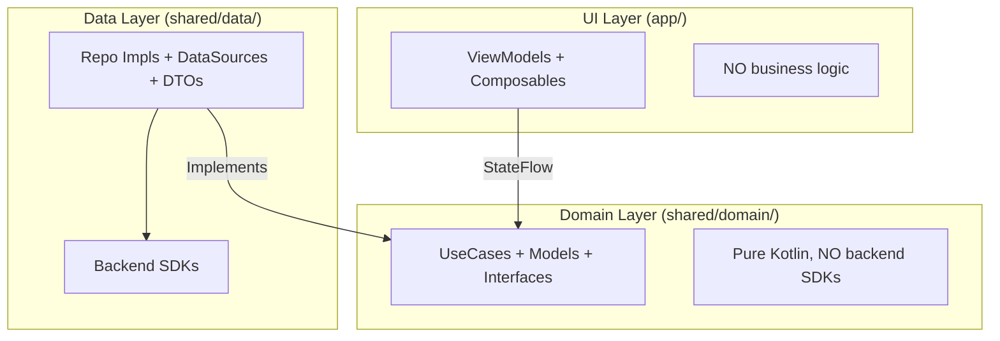

# Overview
- [📦 Repository Context](#-repository-context)
- [🏗️ Architectural Integrity](#️-architectural-integrity)
- [🎨 UI & Coding Standards](#-ui--coding-standards)
- [📩 Pre-Submission Checklist](#-pre-submission-checklist)
- [🎁 Submission & PR Template](#-submission--pr-template)

---

# 📦 Repository Context

- **Default Branch:** `main`
- **Source Repository:** `synapseSRC/synapseApp`

---


# 🏗️ Architectural Integrity

We follow a strict **Clean Architecture** pattern in this KMP monorepo. Keep the boundaries sharp! 🔪

### 🧱 Non-Negotiable Rules
- **NO Direct Backend SDKs in Domain** 🚫 → Use `Repository` interfaces.
- **NO Backend Types in Domain** 🚫 → Use **DTOs** (Data) & **Domain Models** (Business) with Mappers.
- **NO Hardcoded Backend Assumptions** 🚫 → Abstract via `DataSource` (e.g., `SupabaseDataSource`).
- **NO Android-only Room** 🚫 → Use **SQLDelight** or **Room KMP**.
- **NO Platform Leaks** 🚫 → No `android.*` or `java.*` in `commonMain`.
- **NO Business Logic in UI/ViewModels** 🚫 → Delegate to **UseCases**.
- **NO Mutable State in Composables** 🚫 → Use `StateFlow`.
- **NO God ViewModels** 🚫 → One ViewModel per feature/screen.

### 📐 Layer Boundaries


---

# 🎨 UI & Coding Standards

Don't be a "hardcoder"! Keep our UI flexible and themeable! 🌈

- **NO Hardcoded Colors** 🖌️
  - Use `MaterialTheme.colorScheme`.
  - Reference: `com.synapse.social.studioasinc.feature.shared.theme`.
- **NO Hardcoded Dimensions/Spacing** 📏
  - Use the project's `Spacing` tokens.
  - Reference: `com.synapse.social.studioasinc.feature.shared.theme.Spacing`.
- **NO Hardcoded Text** ✍️
  - Always use `strings.xml` resources.
  - Path: `app/src/main/res/values/strings.xml`.

---

# 📩 Pre-commit steps
1. ✅ **Build MUST Pass**: No submission without a successful build.
2. 🔍 **Code Review**: Self-review or peer-review required.
3. 🧹 **No Cache Files**: Verify with `git status`.
4. 🚫 **Meaningful Commits**: No empty or "fixed stuff" commits.

---

# 🎁 Submission & PR Template

ALWAYS include a **PRESENT** for the user! 🎁

### 🧾 Pull Request Template

```md
**Title:** `[emoji] [type]: [concise summary]`

### 📝 Description
- **💡 What:** [Changes made]
- **🎯 Why:** [Motivation/Problem solved]

### ✅ Build Status
The build passed/failed/(N/A)
```