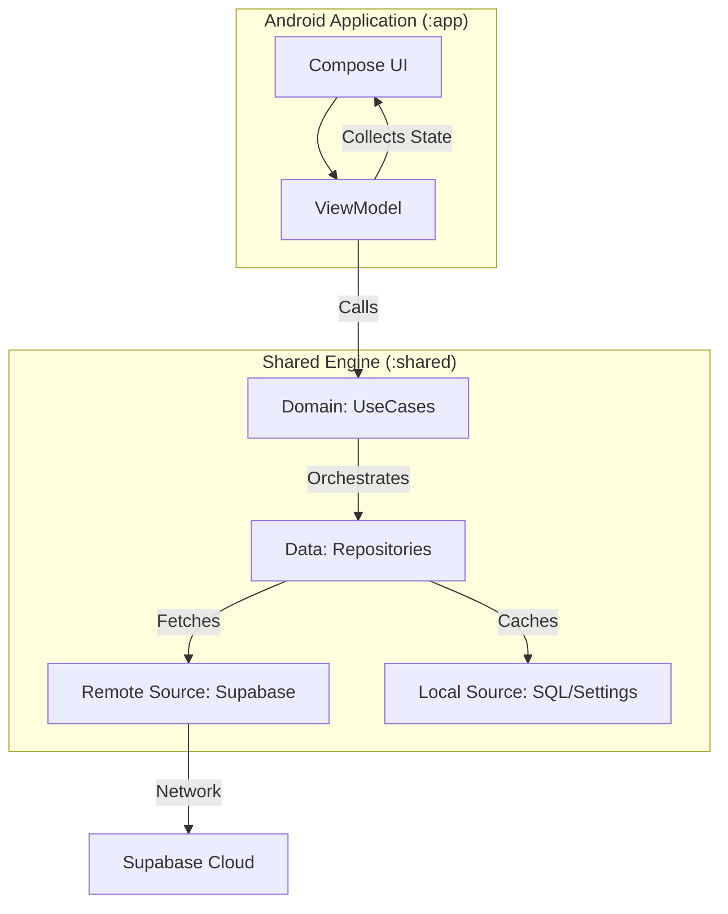

# Synapse Social

Next-Gen Social Network Client - Native UI, Kotlin Multiplatform, and Supabase Powered.

[](#)
[](https://kotlinlang.org/)
[](https://developer.android.com/jetpack/compose)
[](https://supabase.com/)

---

## Table of Contents
- [Overview](#overview)
- [Features](#features)
- [Tech Stack](#tech-stack)
- [Architecture](#architecture)
- [Project Structure](#project-structure)
- [Installation & Setup](#installation--setup)
- [Usage Examples](#usage-examples)
- [API Documentation](#api-documentation)
- [Configuration Guide](#configuration-guide)
- [Testing](#testing)
- [Deployment](#deployment)
- [Contributing](#contributing)
- [License](#license)
- [Contact](#contact)

---

## Overview
**Synapse Social** is a high-performance, cross-platform social media client built using **Kotlin Multiplatform (KMP)**. It aims to provide a native experience on both Android and iOS while sharing the core business logic, data handling, and security protocols. Powered by **Supabase**, Synapse offers a robust backend including real-time updates, secure authentication, and scalable storage.

---

## Features
- **Kotlin Multiplatform (KMP):** Shared logic across Android and iOS for consistent behavior and faster development.
- **Native UI:** 100% Jetpack Compose for Android and SwiftUI for iOS.
- **Supabase Integration:** Full-stack features including Auth, Database, Storage, and Real-time notifications.
- **Privacy First:** Planned End-to-End Encryption (E2EE) using the Double Ratchet protocol.
- **Multi-Source Media Upload:** Supports Cloudinary, ImgBB, and Supabase Storage.
- **Real-time Chat:** Seamless messaging experience powered by Supabase Realtime.
- **Dynamic Content:** Support for Posts, Reels, Polls, and rich media (Markdown & LaTeX).

---

## Tech Stack

### Shared Engine (:shared)
- **Networking:** [Ktor](https://ktor.io/)
- **Backend-as-a-Service:** [Supabase-kt](https://github.com/jan-tennert/supabase-kt)
- **Local Database:** [SQLDelight](https://cashapp.github.io/sqldelight/)
- **Dependency Injection:** [Koin](https://insert-koin.io/)
- **Serialization:** [kotlinx.serialization](https://github.com/Kotlin/kotlinx.serialization)
- **Async/Flow:** [Coroutines](https://kotlinlang.org/docs/coroutines-overview.html)
- **Logging:** [Napier](https://github.com/aakira/Napier)

### Android Application (:app)
- **UI Framework:** [Jetpack Compose](https://developer.android.com/jetpack/compose)
- **Dependency Injection:** [Hilt](https://developer.android.com/training/dependency-injection/hilt-android)
- **Image Loading:** [Coil](https://coil-kt.github.io/coil/)
- **Video Player:** [Media3 / ExoPlayer](https://developer.android.com/guide/topics/media/media3)
- **Notifications:** [OneSignal](https://onesignal.com/)
- **Charts:** [Vico](https://github.com/patrykandpatrick/vico)

### iOS Application (:iosApp)
- **UI Framework:** [SwiftUI](https://developer.apple.com/xcode/swiftui/)
- **Integration:** Consumes KMP shared logic as a static framework.

---

## Architecture

Synapse Social follows **Clean Architecture** principles to ensure maintainability and scalability.

### High-Level Design


### Layer Responsibilities
1. **Presentation Layer:** Platform-specific (Compose/SwiftUI). Renders UI and captures user input.
2. **Domain Layer (Shared):** Pure Kotlin. Contains UseCases and business models.
3. **Data Layer (Shared):** Implements Repository interfaces, manages local caching (SQLDelight) and remote data (Supabase/Ktor).

---

## Project Structure
```text
Synapse/
├── app/                  # Android Application (Native UI)
├── shared/               # KMP Shared Engine (Logic, Data, Domain)
├── iosApp/               # iOS Application (Native SwiftUI)
├── docsWeb/              # Project Documentation (Astro/Starlight)
├── gradle/               # Build configuration
└── gradlew               # Gradle Wrapper
```

---

## Installation & Setup

### Prerequisites
- **Android Studio Ladybug (2024.2.1)+**
- **JDK 17**
- **Xcode** (For iOS development)

### Quick Start
1. **Clone the Repository**
   ```bash
   git clone https://github.com/studioasinc/synapse.git
   cd synapse
   ```
2. **Environment Configuration**
   Create a `gradle.properties` in the root directory (or your user home) with the following:
   ```properties
   SUPABASE_URL=your_supabase_url
   SUPABASE_ANON_KEY=your_anon_key
   # Add other keys as needed (Cloudinary, Gemini, etc.)
   ```
3. **Sync and Build**
   - Open the project in Android Studio.
   - Wait for Gradle sync to finish.
   - Run the `:app` configuration on your emulator or device.

---

## Usage Examples

### Executing a UseCase (Shared)
```kotlin
// Example: Signing in a user
val signInUseCase = get<SignInUseCase>() // Obtained via Koin
val result = signInUseCase(email = "user@example.com", password = "securePassword")

result.onSuccess { session ->
    println("Logged in successfully!")
}.onFailure { error ->
    println("Login failed: ${error.message}")
}
```

### Dependency Injection (Shared)
```kotlin
val storageModule = module {
    single<StorageRepository> { StorageRepositoryImpl(get(), get()) }
    single { UploadMediaUseCase(get(), get(), get()) }
}
```

---

## API Documentation
Synapse Social leverages the **Supabase Ecosystem** for its backend services:
- **Authentication:** Email/Password, OAuth (planned), Passkeys.
- **Database (PostgreSQL):** All user data, posts, and relations.
- **Storage:** Media assets managed via Supabase Storage, with fallback options to Cloudinary/ImgBB.
- **Realtime:** Used for live chat and notification updates.

Detailed API references can be found in the `shared/src/commonMain/kotlin/.../data/repository` directory.

---

## Configuration Guide

The following environment variables/properties are required:

| Variable | Description |
| :--- | :--- |
| `SUPABASE_URL` | Your Supabase project URL |
| `SUPABASE_ANON_KEY` | Public anonymous key for Supabase |
| `CLOUDINARY_CLOUD_NAME` | Cloudinary account identifier |
| `GEMINI_API_KEY` | API Key for AI-powered features |
| `ONESIGNAL_APP_ID` | App ID for Push Notifications |

---

## Testing
Run unit tests for the shared module and Android app using:
```bash
./gradlew test
```
- **Shared Tests:** `shared/src/commonTest`
- **Android Tests:** `app/src/test`

---

## Deployment

### Android
- Build Release APK/Bundle: `./gradlew :app:assembleRelease`
- Ensure `keystore.properties` is configured for signing.

### iOS
- Open `iosApp/iosApp.xcodeproj` in Xcode.
- Select the destination (Simulator or Device).
- Build and Archive for distribution.

---

## Contributing
We welcome contributions!
1. Fork the project.
2. Create your feature branch (`git checkout -b feature/AmazingFeature`).
3. Adhere to the standards in `AGENTS.md`.
4. Commit your changes (`git commit -m 'Add some AmazingFeature'`).
5. Push to the branch (`git push origin feature/AmazingFeature`).
6. Open a Pull Request.

Refer to `docsWeb/src/content/docs/guides/contributing.md` for full details.

---

## License
This project is currently **Unlicensed**.

---

## Contact
- **Project Lead:** Ashik Ahmed ([ashikahamed0@gmail.com](mailto:ashikahamed0@gmail.com))
- **Organization:** StudioAs Inc.

---
*Built with ❤️ by the StudioAs Inc. team.*
