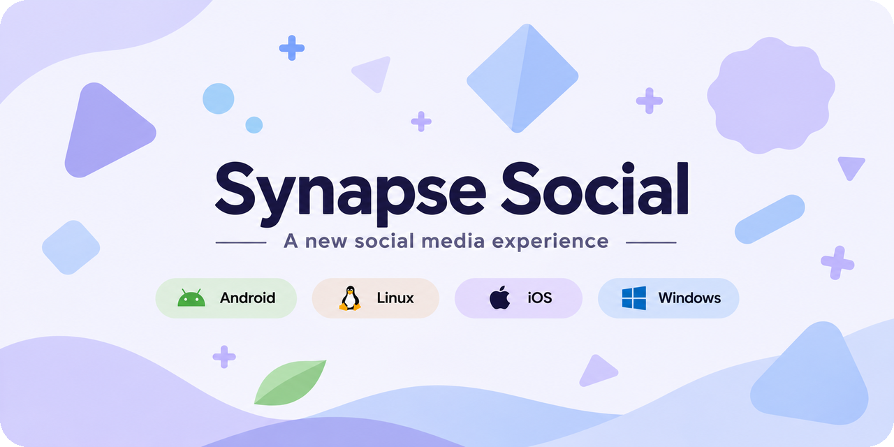
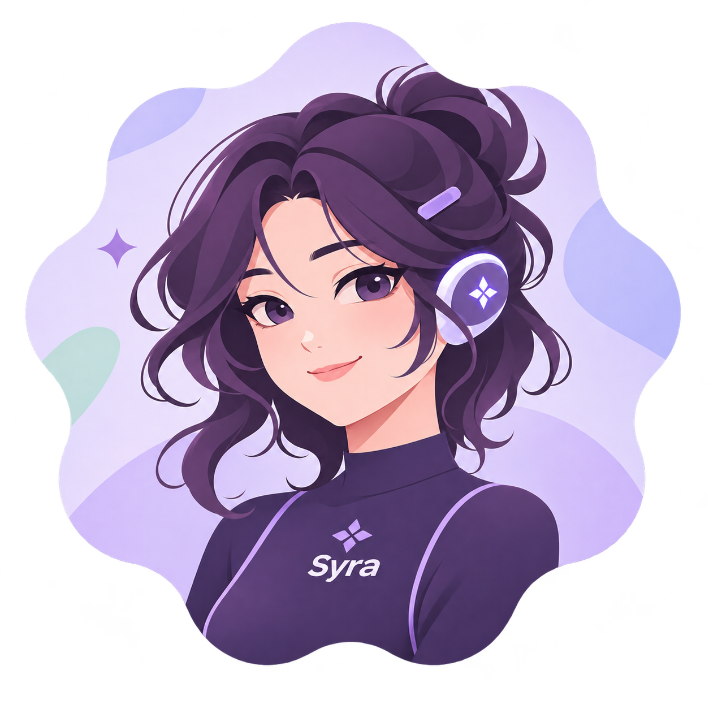

  

**Synapse Social** is one of the best-looking open-source cross-platform social media in the world.

---

### Agent Syra

Syra is an AI agent account on Synapse Social. She behaves like a regular user, with her own profile and the ability to participate in conversations and interact with the community.

**What Syra can do:**

- 💬 **Reply to Direct Messages** — Respond to users in private conversations and provide assistance through DMs.
- 💭 **Respond to Mentions** — Join conversations when users mention `@syra` in their messages.
- 🗨️ **Participate in Discussions** — Engage with users and contribute relevant responses to conversations.
- 🤝 **Interact with Users** — Communicate with community members just like any other account.
- 👤 **Maintain Her Own Profile** — Have a dedicated profile and identity within Synapse Social.
- 🌐 **Be Part of the Community** — Participate as a regular account in the social network rather than through a separate chatbot interface.

 
